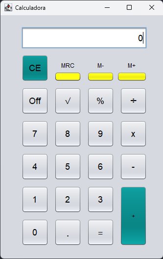

# 🧮 Calculadora Java

Uma calculadora desenvolvida em **Java Swing** através da IDE **NetBeans**, criada com o objetivo de estudar **Java** e a construção de interfaces gráficas com **Swing**.

## 📸 Screenshot



## 🕹️ Sobre o projeto

O projeto simula uma calculadora simples, com operações aritméticas básicas, raiz quadrada, porcentagem e um sistema de memória (M+, M-, MRC).

A proposta principal foi utilizar sua construção como forma de praticar **Java** e o desenvolvimento de interfaces gráficas com **Swing**, incluindo eventos de botões, manipulação de estado e formatação de valores exibidos ao usuário.

## ✨ Funcionalidades

- Operações básicas: soma, subtração, multiplicação e divisão;
- Cálculo de raiz quadrada;
- Cálculo de porcentagem;
- Sistema de memória (M+, M-, MRC);

## 🎮 Controles

| Botão      | Ação                                  |
| ---------- | ------------------------------------- |
| `0` - `9`  | Inserir dígito                        |
| `.`        | Inserir ponto decimal                 |
| `+ - x ÷`  | Operações aritméticas                 |
| `=`        | Calcular resultado                    |
| `√`        | Raiz quadrada do valor atual          |
| `%`        | Calcular porcentagem                  |
| `CE`       | Limpar valor atual                    |
| `M+`       | Somar valor atual à memória           |
| `M-`       | Subtrair valor atual da memória       |
| `MRC`      | Recuperar/limpar valor da memória     |
| `Off`      | Fechar a aplicação                    |

## 🧠 Conceitos de Java e Swing utilizados

Por ter sido desenvolvido como estudo de **Java** e **Java Swing**, explorei conceitos como:

- **JFrame** e componentes Swing (`JButton`, `JTextField`, `JLabel`);
- **GroupLayout** para organização dos componentes na tela;
- **ActionListener** e expressões lambda para tratamento de eventos;
- **Encapsulamento** do estado da calculadora em atributos privados;
- **Máquina de estados** simples para controlar buffer de entrada, operador pendente e memória;

## 🛠️ Tecnologias

- **Java**
- **Java Swing**
- **AWT**
- **NetBeans GUI Builder**

## ▶️ Como executar

### Pré-requisitos

É necessário ter o **Java JDK** instalado.

### Executando o projeto

1. Clone o repositório:

```bash
git clone <URL-DO-REPOSITORIO>
```

2. Abra o projeto em uma IDE, como NetBeans, IntelliJ IDEA ou Eclipse.
3. Execute a classe:

```text
code.java
```

4. Utilize o mouse para interagir com os botões da calculadora.

## 📚 Contexto

Este projeto foi desenvolvido como uma forma de praticar **Java** e **Java Swing**, colocando em prática conceitos de interfaces gráficas, eventos de botões e organização do estado de uma aplicação.

Apesar de sua simplicidade, o projeto serviu como uma experiência prática para trabalhar com **componentes Swing, layouts, tratamento de eventos e lógica de estado em Java**.

## 🚧 Possíveis melhorias

Algumas funcionalidades que poderiam ser implementadas em uma versão futura:

* Suporte a entrada via teclado;
* Histórico de operações realizadas;

---

**Projeto desenvolvido para fins de estudo e aprendizado.**
